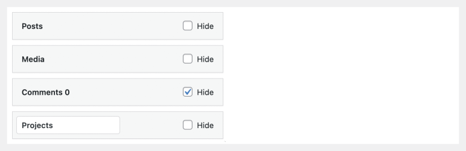
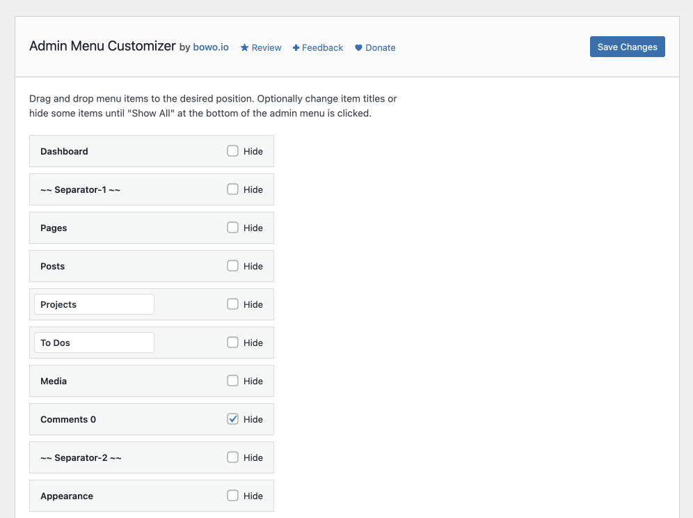

# Admin Menu Customizer

Contributors: qriouslad  
Donate link: https://paypal.me/qriouslad  
Tags: menu, admin menu, menu order, hide menu, custom menu   
Requires at least: 4.6  
Tested up to: 6.1.1  
Stable tag: 1.0.0  
Requires PHP: 5.6  
License: GPLv2 or later  
License URI: https://www.gnu.org/licenses/gpl-3.0.html

Customize the order of the admin menu and optionally change menu item titles or hide some items.

## Description

**Admin Menu Customizer** allows you to:
* Change the order of menu items.
* Change the title of menu items added by active plugins and theme.
* Hide menu items on page load, with a "Show All" toggle to reveal them on click.

This is useful to keep your admin menu tidy when your site grows more complex and have more menu items than can fit on the screen. It also helps you and site editors, authors and contributors focus on the most relevant menu items, e.g. for managing content.

### Give Back

* [A nice review](https://wordpress.org/plugins/admin-menu-customizer/#reviews) would be great!
* [Give feedback](https://wordpress.org/support/plugin/admin-menu-customizer/) and help improve future versions.
* [Github repo](https://github.com/qriouslad/admin-menu-customizer) to contribute code.
* [Donate](https://paypal.me/qriouslad) and support my work.

### Check These Out Too

* [Admin and Site Enhancements](https://wordpress.org/plugins/admin-site-enhancements/) helps you to easily enhance various admin workflows and site aspects while replacing multiple plugins doing it.
* [Flexible Scroll Top](https://wordpress.org/plugins/flexible-scroll-top/) and [Floating Share Buttons](https://wordpress.org/plugins/floating-share-button/) is a lightweight combo with minimalist UI.
* [System Dashboard](https://wordpress.org/plugins/system-dashboard/): Central dashboard to monitor various WordPress components, processes and data, including the server.
* [Debug Log Manager](https://wordpress.org/plugins/debug-log-manager/): Log PHP, database and JavaScript errors via WP_DEBUG with one click. Conveniently create, view, filter and clear the debug.log file.
* [Variable Inspector](https://wordpress.org/plugins/variable-inspector/): Inspect PHP variables on a central dashboard in wp-admin for convenient debugging.
* [Code Explorer](https://wordpress.org/plugins/code-explorer/): Fast directory explorer and file/code viewer with syntax highlighting.

## Screenshots

1. Main page to customize admin menu
   

## Frequently Asked Questions

### Why build this plugin?

I wanted something simpler in terms of UI and something useful enough in terms of features than what is available.

## Changelog

### 1.0.0 (2022.10.30)

* Initial stable release. 